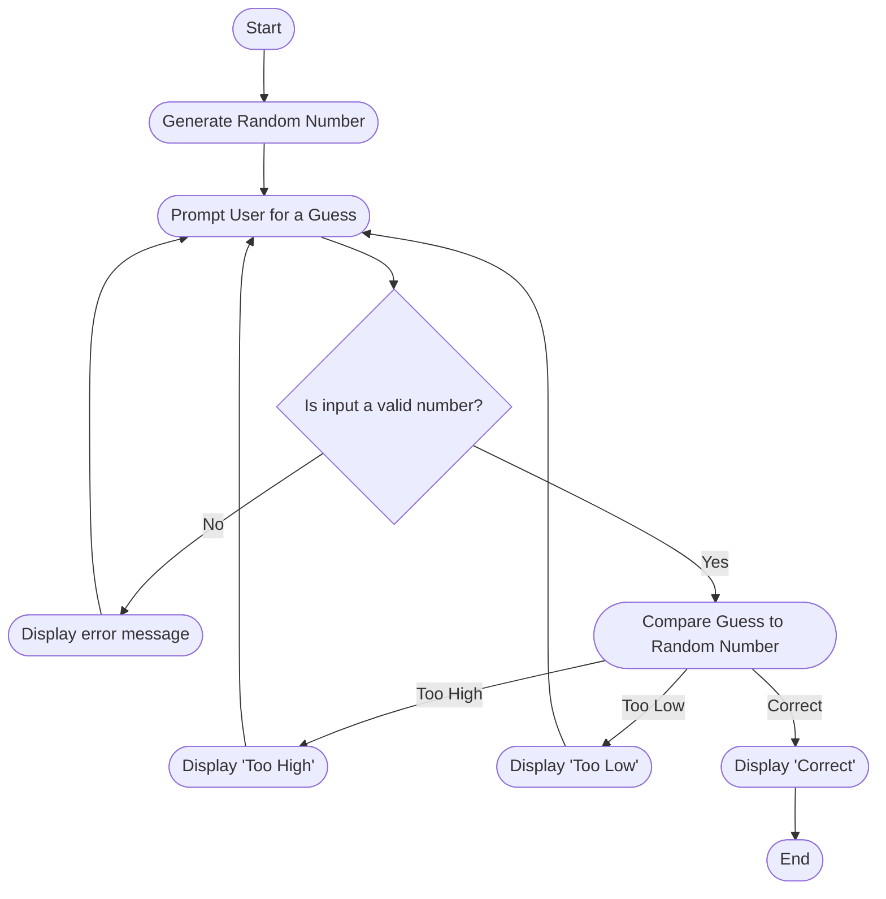

# Guessing Game Flowchart

Start: The process begins.

Generate Random Number: A random number is generated. The specific range is defined in the code and is not shown in the flowchart.

Prompt User for a Guess: The user is asked to enter a guess.

Validate Input: The system checks whether the input is a valid number.

If invalid, an error message is shown and the user is prompted again.

If valid, the process continues.

Check Guess: The system compares the user’s input to the random number.

If too high or too low, it displays a message and re-prompts.

If correct, a success message is shown.

End: The process finishes once the user guesses the number correctly.
